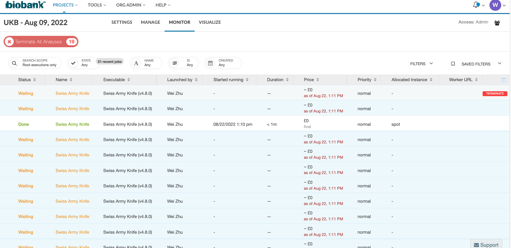

# UKB_extract_variants

DNAnexus users can extract UKB variants using the swiss-army-knife app via DNAnexus portal or use the command-line as bellow: 

```bash
dx run app-swiss-army-knife \
-iin=project-GFk7Z88JbjP3P0Gz6q09vXFX:file-G97bV6jJykJqFjKv34JYVZ9Y \
-iin=project-GFk7Z88JbjP3P0Gz6q09vXFX:file-G97bj8jJykJbVkp97jxjQ3zJ \
-icmd="bcftools view --regions chr14:95086244-95158010 ukb23157_c14_b24_v1.vcf.gz -O z > UKBB_DICER1_500K.vcf.gz" --destination "/ws" -y
```

Both of the two options are good for small use but it will take some effort if you want to extract variants from many different pVCF blocks.

extract_genes_ukb_pvcf.pl is a PERL script to extract variants of interest (e.g., in a list of genes) from the UK Biobank data hosted at DNAnexus. 

Briefly, the script takes a list of genes and get their locations in the reference genome hg38. Then, find the overlapped pVCF blocks.  Query DNAnexus project space to get the object name of the vcf files (and their index files as well). Finally, output the essential information in JSON format for the use of swiss-army-knife app.  


## Dependencies
+ JSON perl module
Perl modules can be installed in many ways. For example, via conda (or mamba if available):
```bash
conda install -c bioconda perl-json
```
+ dx-toolkit (DNAnexus SDK)
dx-toolkit is available to download [here](https://documentation.dnanexus.com/downloads).  For NIH/NCI users, its installation is not needed as it is available as module ***DNAnexus*** at Biowulf.

## Get started
The perl script takes five inputs:
+ UKB project path to the pVCF files
  + see https://documentation.dnanexus.com/user/projects/path-resolution#path-syntax
+ [gene regions in hg38](./data/hg38_genes.tsv) 
+ [pVCF block files](./data/pvcf_blocks.txt)
+ [targeted genes](./data/g28.lst)
+ output folder 


### Get the JSON files
```bash
### For Biowulf users
sinteractive # to start an interactive session 

module load DNAnexus

### login to DNAnexus using dx and select UKB project
dx login

### run the perl script
perl  extract_genes_ukb_pvcf.pl "UKB - Aug 09, 2022:Bulk/Exome sequences/Population level exome OQFE variants, pVCF format - final release/" hg38_genes.tsv pvcf_blocks.txt g28.lst JSON

### JSON will be created by the PERL script, and some JSON files will be generated under the JSON folder.

```

+ The expected output from the PERL script
```bash
ls JSON/
UKBB_500K.ACAD11.0.json   UKBB_500K.LGR5.0.json
UKBB_500K.ARID1B.0.json   UKBB_500K.MAP2.0.json
UKBB_500K.ATR.0.json      UKBB_500K.MITF.0.json
UKBB_500K.BLM.0.json      UKBB_500K.MKX.0.json
UKBB_500K.BRIP1.0.json    UKBB_500K.NFX1.0.json
UKBB_500K.DGKD.0.json     UKBB_500K.NID2.0.json
UKBB_500K.DNAJC21.0.json  UKBB_500K.NNT.0.json
UKBB_500K.ERBB4.0.json    UKBB_500K.POLH.0.json
UKBB_500K.ERCC2.0.json    UKBB_500K.POLQ.0.json
UKBB_500K.ERCC5.0.json    UKBB_500K.POLR1A.0.json
UKBB_500K.ERCC8.0.json    UKBB_500K.UBA7.0.json
UKBB_500K.FLCN.0.json     UKBB_500K.UBA7.1.json
UKBB_500K.GABPB1.0.json   UKBB_500K.WNT4.0.json
UKBB_500K.IDE.0.json      UKBB_500K.WNT4.1.json
UKBB_500K.KIF20A.0.json   UKBB_500K.WRN.0.json
```

### Run Swiss-army-knife app.
The swiss-army-knife app will take JSON as input and extract variants to the target location.

```bash
### make a directory "ws" at your DNAnexus project space (you may choose any preferred name other than "ws")
dx mkdir /ws


### Test to run (optional)
dx run app-swiss-army-knife -f JSON/UKBB_500K.WNT4.0.json --destination "/ws" -y

### Process batch of all JSON files using the unix command parallel
ls JSON/*.json | parallel -j 3 'dx run app-swiss-army-knife -f {} --destination "/ws" -y '

### dx run will trigger the processes at DNAnexus servers and you may monitor them via DNAnexus portal (see the snapshot below).

### Wait until all the jobs are completed remotely.

```




### Download pVCF files from remote server to your "local" folder.
```bash
mkdir pvcf

dx download /ws/UKBB_500K.*.vcf.gz -f -o pvcf/
```